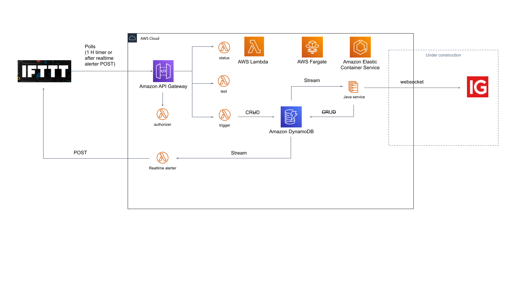

# about

# dynamoDB Schema (proposal)
| entity | PK | SK | other fields
|---|---|---|---
|trigger|TR#\<triggerID\>|TR#\<triggerID\>|triggerId:S, triggerFields:S(stringifiedJson), triggerEvents:S(StringifiedJson)
|insrtrument|INSTRUMENT|EPIC#\<epic\>|epic:S, name:S,
